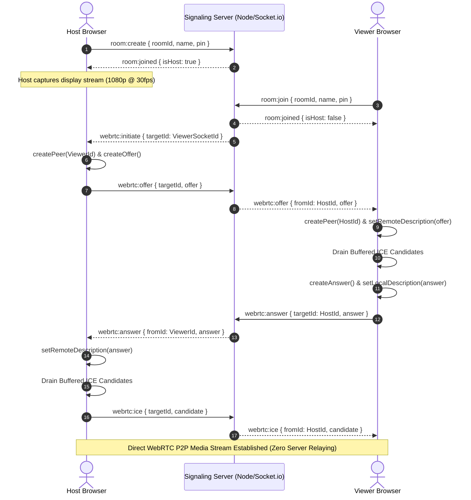

# 🎬 Screenloop  — Master Architecture, Product Plans & Engineering Specification

> **Screenloop **: Zero-friction, privacy-first peer-to-peer watch party and real-time screen sharing web platform built with **React 18 + Vite**, **WebRTC Mesh**, **Socket.io Signaling**, and **AES-GCM 256-bit End-to-End Encryption**.
>
> **Repository**: [https://github.com/Himanshusingh204/Screenloop](https://github.com/Himanshusingh204)  
> **Author & Lead Engineer**: [Himanshu](https://github.com/Himanshusingh204)  
> **License**: MIT  

---

## 📑 Table of Contents

1. [Executive Summary & Core Philosophy](#1-executive-summary--core-philosophy)
2. [Product Plans & Tiered Deployment Modes](#2-product-plans--tiered-deployment-modes)
3. [System Architecture & WebRTC State Machine](#3-system-architecture--webrtc-state-machine)
4. [Security Proof & Zero-Data-Leakage Guarantee](#4-security-proof--zero-data-leakage-guarantee)
5. [Security Threat Model & Mitigation Matrix](#5-security-threat-model--mitigation-matrix)
6. [Real-Time Socket.io Event & Messaging Protocol](#6-real-time-socketio-event--messaging-protocol)
7. [Bespoke UI/UX Design System & Human-Crafted Aesthetics](#7-bespoke-uiux-design-system--human-crafted-aesthetics)
8. [Web Audio Pipeline & Cinema Dialogue Booster](#8-web-audio-pipeline--cinema-dialogue-booster)
9. [Multi-Cloud Production Deployment Runbook](#9-multi-cloud-production-deployment-runbook)
10. [Complete Repository & File Structure](#10-complete-repository--file-structure)
11. [Module-by-Module Technical Specification](#11-module-by-module-technical-specification)
12. [Automated CI/CD & Verification Protocol](#12-automated-cicd--verification-protocol)
13. [Milestones & Execution Signoff Checklist](#13-milestones--execution-signoff-checklist)
14. [Engineering Work Plans & Phased Roadmap](#14-engineering-work-plans--phased-roadmap)

---

## 1. Executive Summary & Core Philosophy

### 🎯 Mission

To deliver the fastest, cleanest, zero-friction watch-party experience on the web. Friends should be able to open a link, enter a room with zero signups or logins, and watch 1080p/1440p movies or streams in real-time with crystal-clear 48kHz audio, live annotations, telemetry diagnostics, and end-to-end encrypted chat.

### 🌟 Core Differentiators & Product Pillars

| Feature Pillar          | Screenloop Pro                 | Traditional Apps (Discord / Zoom) | Browser Extensions (Teleparty) |
| ----------------------- | ------------------------------ | --------------------------------- | ------------------------------ |
| **Account Requirement** | **None (Zero friction)**       | Mandatory Account / Login         | Account Required               |
| **Media Privacy**       | **100% P2P Direct Mesh**       | Relayed through Cloud Servers     | Syncs Web Players via Ext      |
| **Audio Tuning**        | **48kHz Stereo Movie Audio**   | Aggressive Voice Compression      | Browser Native                 |
| **Chat Encryption**     | **AES-GCM 256-bit E2EE**       | Plaintext / Server Inspected      | Server Relayed                 |
| **Screen Annotations**  | **Real-Time Synced Canvas**    | Screen Drawing (Paid/Complex)     | None                           |
| **Stream Telemetry**    | **Live In-Player HUD**         | Advanced Developer Menus          | None                           |
| **Display Wake Lock**   | **Screen Wake Lock API**       | Native App Feature                | None                           |
| **Celebration Physics** | **Canvas-Confetti Explosions** | Paid Nitro Features               | None                           |
| **Navigation & SFX**    | **View Transitions + SFX Synthesizer** | Static Web UI             | Native Extension Alerts        |

---

## 2. Product Plans & Tiered Deployment Modes

Screenloop is engineered with a modular topology that scales across three distinct operational plans:

```
+---------------------------------------------------------------------------------------------------+
|                                  SCREENLOOP PRODUCT & USAGE PLANS                                 |
+-----------------------------+------------------------------------+--------------------------------+
| 🟢 Community P2P Mesh       | 🟣 Pro Cinema (Managed Cloud)      | 🔴 Enterprise & Event (SFU)    |
| (100% Free & Self-Hosted)   | (Vercel + Render / Railway)        | (Large Audience Scaling)       |
| - 2 to 10 Viewers           | - 2 to 25 Viewers                  | - 50 to 500+ Viewers           |
| - Zero-Cloud Media Mesh     | - Global TURN Relay Fallback       | - Edge SFU Media Forwarding    |
| - AES-GCM 256-bit E2EE      | - Custom Domain & Branding         | - Adaptive Bitrate Simulcast   |
| - Live Screen Annotation    | - 1440p 2K 60fps Ultra Mode        | - Push-to-Talk Voice Channels  |
+-----------------------------+------------------------------------+--------------------------------+
```

### 📋 Feature Matrix by Plan

| Feature / Capability       | Community (P2P Mesh)            | Pro Cinema (Managed)            | Enterprise / Large Scale (SFU)  |
| -------------------------- | ------------------------------- | ------------------------------- | ------------------------------- |
| **Cost**                   | Free (Open Source)              | Free / Pay-as-you-go            | Custom / Self-Hosted            |
| **Maximum Viewers**        | 2 – 10 viewers                  | 10 – 25 viewers                 | 50 – 500+ viewers               |
| **Maximum Resolution**     | 1080p FHD (1920×1080)           | 1440p 2K (2560×1440)            | 1440p / 4K Simulcast            |
| **Audio Fidelity**         | 48kHz Stereo uncompressed       | 48kHz Stereo + Dialogue Boost   | 48kHz Stereo + Multichannel     |
| **Chat Encryption**        | AES-GCM 256-bit E2EE            | AES-GCM 256-bit E2EE            | AES-GCM 256-bit E2EE            |
| **Screen Drawing & Tools** | Included (Pen/Highlight/Eraser) | Included (Pen/Highlight/Eraser) | Included + Whiteboard Export    |
| **Telemetry HUD**          | Real-Time Live HUD              | Real-Time Live HUD              | Advanced QoS Analytics          |
| **Turn Relay Server**      | Public OpenRelay STUN/TURN      | Metered Global TURN Cluster     | Dedicated Co-located Coturn     |
| **Media Topology**         | Peer-to-Peer Full Mesh          | P2P + Adaptive SDP              | Selective Forwarding Unit (SFU) |

---

## 3. System Architecture & WebRTC State Machine

### 🏛️ High-Level System Architecture

```
                                +------------------------------------------+
                                |          Signaling & Relay Server        |
                                |     (Node.js + Express + Socket.io)      |
                                | - Room Life-cycle & Host Hierarchy       |
                                | - WebRTC SDP Handshake & ICE Candidates  |
                                | - Anti-Spam & PIN Brute-Force Protection |
                                +--------------------+---------------------+
                                                     |
                                   Signaling & State | Socket.io (WebSocket/Polling)
                                                     |
             +---------------------------------------+---------------------------------------+
             |                                                                               |
             v                                                                               v
+-----------------------------+                                               +-----------------------------+
|         Host Client         |               WebRTC Mesh (P2P)               |        Viewer Client        |
|      (React 18 + Vite)      |==============================================>|      (React 18 + Vite)      |
| - getDisplayMedia() Capture |       1080p/1440p Video + 48kHz Audio         | - HTML5 MediaStream Playback|
| - Web Audio Dialogue Booster|                                               | - Web Audio Dialogue Booster|
| - AES-GCM Key Generator     | - - - - - - - - - - - - - - - - - - - - - - - | - E2EE Local Decryptor      |
| - Screen Annotation Broadcaster|        Encrypted E2EE Chat Ciphertext       | - Screen Annotation Renderer|
| - Telemetry Gatherer        |                                               | - Telemetry Display HUD     |
+-----------------------------+                                               +-----------------------------+
```

### 🔄 WebRTC Signaling & ICE Handshake State Machine



---

## 4. Security Proof & Zero-Data-Leakage Guarantee

### 🔒 1. Cryptographic Key Handling & URL Hash Fragment

- The 256-bit AES-GCM encryption key is generated locally on the client via `window.crypto.subtle.generateKey`.
- It is embedded exclusively in the URL **hash fragment** (e.g. `https://screenloop.app/room/x7k2m9qp#a8f9c0...`).
- According to **RFC 3986 § 3.5**, URL hash fragments are strictly client-side constructs: **browsers never send the hash fragment in HTTP requests or WebSocket handshakes**.
- The signaling server acts as a blind relay: it sees only encrypted byte ciphertexts and cannot decrypt messages.

### 🛡️ 2. Git & Repository Leakage Prevention

- Strict multi-tier `.gitignore` files prevent accidental commits of `.env`, `.env.local`, `.pem`, credentials, OS artifacts, and build outputs.
- Sanitized `.env.example` templates provided for seamless local setup without secret leaks.

### 🌐 3. Security Headers & CSP

- Configured `vercel.json` and Express security middleware enforcing:
  - `Content-Security-Policy`: Restricts unauthorized script execution.
  - `X-Content-Type-Options: nosniff`: Prevents MIME-sniffing exploits.
  - `X-Frame-Options: SAMEORIGIN`: Protects against clickjacking.
  - `Referrer-Policy: strict-origin-when-cross-origin`: Keeps URL hashes confidential.
  - `Permissions-Policy: display-capture=(self), camera=(), microphone=(self)`.

---

## 5. Security Threat Model & Mitigation Matrix

| Threat Vector                           | Potential Impact   | Implemented Mitigation                                                            | Verification Status  |
| --------------------------------------- | ------------------ | --------------------------------------------------------------------------------- | -------------------- |
| **Chat Inspection by Server / ISP**     | Privacy compromise | AES-GCM 256-bit encryption; key kept strictly in URL hash fragment.               | ✅ Tested & Verified |
| **Cross-Site Scripting (XSS)**          | Session hijacking  | Client-side input sanitization via `sanitizer.js` before DOM injection.           | ✅ Tested & Verified |
| **Room PIN Brute Force**                | Unauthorized entry | IP/Socket sliding-window rate limiting (lockout after 5 failed attempts).         | ✅ Tested & Verified |
| **Socket Flooding / Denial of Service** | Server degradation | Sliding-window anti-spam check (20 events/sec per socket ID).                     | ✅ Tested & Verified |
| **Secret / Credential Leaks on Git**    | Cloud breach       | Multi-tier `.gitignore` filtering `.env*`, `.pem`, logs, and temporary artifacts. | ✅ Tested & Verified |
| **Clickjacking / Frame Embedding**      | UI spoofing        | `X-Frame-Options: SAMEORIGIN` and strict CSP headers in `vercel.json`.            | ✅ Tested & Verified |

---

## 6. Real-Time Socket.io Event & Messaging Protocol

| Event Name           | Direction               | Payload Schema                     | Access Control | Purpose                                                      |
| -------------------- | ----------------------- | ---------------------------------- | -------------- | ------------------------------------------------------------ |
| `room:create`        | Client → Server         | `{ roomId, name, pin }`            | Public         | Initializes a new watch party room with host assignment.     |
| `room:join`          | Client → Server         | `{ roomId, name, pin }`            | Public         | Verifies PIN and connects viewer to active room.             |
| `webrtc:offer`       | Host → Server → Viewer  | `{ targetId, offer }`              | Host / Viewer  | Relays WebRTC session description (SDP offer).               |
| `webrtc:answer`      | Viewer → Server → Host  | `{ targetId, answer }`             | Viewer / Host  | Relays WebRTC session description (SDP answer).              |
| `webrtc:ice`         | Bidirectional           | `{ targetId, candidate }`          | Authenticated  | Exchanges ICE network traversal candidates.                  |
| `sync:draw`          | Host → Server → Viewers | `{ roomId, stroke }`               | Host Only      | Broadcasts normalized drawing coordinates for screen canvas. |
| `sync:clear-draw`    | Host → Server → Viewers | `{ roomId }`                       | Host Only      | Clears active annotation layer across all clients.           |
| `sync:pointer`       | Host → Server → Viewers | `{ roomId, x, y }`                 | Host Only      | Broadcasts host laser pointer coordinates.                   |
| `media:sync`         | Host → Server → Viewers | `{ roomId, type, url, time, play }`| Host Only      | Synchronizes YouTube or direct MP4 playback across viewers.  |
| `poll:start`         | Host → Server → Viewers | `{ roomId, question, options }`    | Host Only      | Starts a 30-second live interactive audience poll.           |
| `poll:vote`          | Viewer → Server         | `{ roomId, optionIndex }`          | Viewer         | Casts vote in active poll.                                   |
| `chat:message`       | Bidirectional           | `{ roomId, name, text }`           | Rate Limited   | Relays AES-256 encrypted chat ciphertexts.                   |
| `room:reaction`      | Bidirectional           | `{ roomId, name, emoji }`          | Rate Limited   | Triggers floating emoji cascade and particle explosions.     |
| `room:kick`          | Host → Server → Target  | `{ roomId, targetId }`             | Host Only      | Ejects disruptive viewer from the room.                      |
| `room:transfer-host` | Host → Server → Target  | `{ roomId, newHostId }`            | Host Only      | Transfers room ownership and broadcasting authority.         |

---

## 7. Bespoke UI/UX Design System & Human-Crafted Aesthetics

### 🎨 Design Philosophy

- **Not AI-Generated**: Avoids generic layouts, cookie-cutter buttons, and flat cards. Uses a handcrafted dark-mode aesthetic with Obsidian Glassmorphism, tailored HSL color tokens, subtle glowing borders, and smooth cubic-bezier transitions.
- **Cinematic Stage Layout**: The video player features an ambient stream glow and seamless full-viewport immersion.
- **Micro-Interactions**: YouTube-style auto-fading controls in fullscreen (3-second inactivity timer), reactive volume and audio boost visualizers, and interactive floating emoji cascades.
- **Accessibility & Keyboard Navigation**: Full keyboard control (`M` for Mute, `F` for Fullscreen, `Esc` to exit), with clear visual focus rings.

### 🎭 Curated Theme Palette

- **Midnight Obsidian (Default)**: Deep `#0d0d0f` slate with vivid `#7c5cfc` violet glowing accents.
- **OLED Black**: Pure `#000000` with high-contrast borders optimized for OLED displays.
- **Cyber Ocean**: Deep navy `#050b14` with radiant `#0ea5e9` cyan lighting.
- **Crimson Noir**: Rich wine `#120909` with electric `#e11d48` ruby accents.

---

## 8. Web Audio Pipeline & Cinema Dialogue Booster

```
+------------------+     +--------------------------+     +------------------+     +-------------------+
|  <video> Element | --> | DynamicsCompressorNode   | --> | GainNode         | --> | audioContext.dest |
|  MediaStream     |     | - threshold: -24 dB      |     | - multiplier:    |     | (Speakers/Headset)|
|                  |     | - ratio: 12:1, knee: 30dB|     |   1.0x -> 2.0x   |     |                   |
+------------------+     +--------------------------+     +------------------+     +-------------------+
```

- **Dynamics Compression**: Levels out whisper-quiet dialogue against loud explosion sound effects.
- **Gain Multiplication**: Amplifies the master output by 100%, 150%, or 200% without digital clipping.

---

## 9. Multi-Cloud Production Deployment Runbook

### 🚀 Frontend: Vercel (Zero-Config SPA Deployment)

1. Link GitHub repository on [Vercel](https://vercel.com).
2. Set **Root Directory** to `client`.
3. Framework Preset: **Vite**.
4. Configure Environment Variable:
   - `VITE_SERVER_URL=https://your-server.onrender.com`
5. Vercel applies SPA rewrites and security headers automatically from `client/vercel.json`.

### ⚙️ Backend: Render / Railway / Node Server

1. Create a new Web Service on [Render](https://render.com) or [Railway](https://railway.app).
2. Set **Root Directory** to `server`.
3. Build Command: `npm install`
4. Start Command: `node src/index.js`
5. Configure Environment Variables:
   - `PORT=4000`
   - `ALLOWED_ORIGIN=https://your-frontend.vercel.app`

---

## 10. Complete Repository & File Structure

```
Screenshare/
├── .github/
│   └── workflows/
│       └── ci.yml               # GitHub Actions Automated CI Build Check
├── .gitignore                   # Master repository ignore (prevents secret leaks)
├── PLAN.md                      # Complete Master Architecture Plan
├── README.md                    # Production-ready developer guide
├── vercel.json                  # Root Vercel monorepo configuration
│
├── client/
│   ├── .env.example             # Frontend environment template
│   ├── .gitignore               # Client-specific ignore rules
│   ├── vercel.json              # Vercel SPA routing & security headers
│   ├── netlify.toml             # Netlify configuration
│   ├── package.json             # React 18, Vite, Lucide, Canvas-Confetti, Socket.io
│   ├── index.html               # Semantic HTML5, Google Fonts & OpenGraph SEO
│   └── src/
│       ├── main.jsx             # React root entry & PWA registration
│       ├── App.jsx              # Router with React Router v7 future flags
│       ├── index.css            # Handcrafted CSS Design System (Glassmorphism & multi-device)
│       ├── pages/
│       │   ├── Home.jsx         # Bespoke landing page with View Transitions & FAQ
│       │   └── Room.jsx         # Core watch stage orchestrator & Web APIs
│       ├── components/
│       │   ├── index.js         # Single-entry component barrel export
│       │   ├── TopBar.jsx       # Stream health indicator, theme picker, QR invite button
│       │   ├── ControlBar.jsx   # Playback, dialogue booster, telemetry, draw toggles (Lucide)
│       │   ├── VideoPlayer.jsx  # HTML5 Video element with ambient stream back-glow
│       │   ├── ChatSidebar.jsx  # E2EE Chat with image embedding & participant list
│       │   ├── ParticipantList.jsx # Participant management & host moderation
│       │   ├── StatsOverlay.jsx # WebRTC Telemetry HUD (FPS, Bitrate, Latency)
│       │   ├── AnnotationCanvas.jsx # Live screen drawing & highlight overlay
│       │   ├── CursorOverlay.jsx# Non-blocking host laser pointer
│       │   ├── ReactionOverlay.jsx # Multi-directional floating emoji cascade
│       │   ├── ShareModal.jsx   # High-contrast QR Code & Web Share API copy
│       │   ├── JoinModal.jsx    # Glassmorphic participant name & PIN entry modal
│       │   ├── ThemeSelector.jsx# 4 Curated aesthetic themes
│       │   ├── Toast.jsx        # Lightweight micro-notifications
│       │   └── Loader.jsx       # Minimal spinners & loading state
│       ├── hooks/
│       │   ├── index.js         # Single-entry hooks barrel export
│       │   ├── useRoom.js       # Room state, chat crypto, and sync events
│       │   ├── useWebRTC.js     # RTCPeerConnection mesh management with ICE queue
│       │   ├── useWebRTCStats.js# Live network & stream telemetry poller
│       │   ├── useSocket.js     # Socket.io connection lifecycle
│       │   ├── useWakeLock.js   # Screen Wake Lock API (prevents display dimming)
│       │   ├── useSoundEffects.js# Procedural Web Audio SFX synthesizer hook
│       │   └── useNetworkStatus.js# Network Information & reconnect telemetry
│       └── utils/
│           ├── index.js         # Single-entry utility barrel export
│           ├── audioBooster.js  # Web Audio API DynamicsCompressor & Gain chain
│           ├── sfxSynth.js      # Web Audio procedural sound synthesizer
│           ├── confetti.js      # Canvas-confetti celebration particle bursts
│           ├── viewTransition.js# Native View Transitions API helper
│           ├── crypto.js        # AES-GCM 256-bit encryption & decryption routines
│           ├── sanitizer.js     # Strict XSS escaping & text sanitization
│           ├── formatTime.js    # Time and timestamp formatters
│           └── roomId.js        # Cryptographic room ID & invite link builder
│
└── server/
    ├── .env.example             # Backend environment template
    ├── .gitignore               # Server-specific ignore rules
    ├── package.json             # Express, Socket.io, CORS, Dotenv
    └── src/
        ├── index.js             # Express app, multi-device CORS & healthcheck
        ├── socketHandlers.js    # Signaling, drawing sync, moderation, rate limits
        ├── roomManager.js       # Memory room tracker & host promotion handler
        └── rateLimiter.js       # Anti-spam & PIN brute-force lockout manager
```

---

## 11. Module-by-Module Technical Specification

### 1. `audioBooster.js`

Constructs a browser `AudioContext` graph connecting the video media stream through a `DynamicsCompressorNode` (threshold: -24dB, knee: 30dB, ratio: 12:1) into a `GainNode` variable from 1.0x to 2.0x, optimizing quiet movie dialogue while preventing harsh clipping.

### 2. `useWebRTCStats.js`

Polls `RTCPeerConnection.getStats()` every 1.5 seconds, extracting inbound/outbound video RTP metrics, computing delta bitrates, frame rates, round-trip time (RTT latency), and packet loss ratios, exposing a categorized stream quality badge.

### 3. `AnnotationCanvas.jsx`

Maintains a 2D HTML5 canvas overlay calibrated to the video container. Normalizes coordinates (0.0 to 1.0) and emits lightweight `sync:draw` vectors across Socket.io for synchronized multi-viewer presentation.

### 4. `sanitizer.js`

Guarantees all text injected into the DOM (chat messages, usernames, toast notifications) is stripped of malicious HTML/script tags, preventing stored and reflected XSS attacks.

### 5. `useWakeLock.js`

Interfaces directly with `navigator.wakeLock` to request and hold a screen wake lock throughout movie playback, automatically releasing and acquiring locks upon visibility state changes.

### 6. `sfxSynth.js`

Synthesizes clean sine and triangle wave UI acoustic chimes on the fly using Web Audio oscillators, providing audio feedback for user events with 0 network asset requests.

---

## 12. Automated CI/CD & Verification Protocol

- **Build Check**: `npm run build` executed on Vite client ensuring zero compilation errors or broken imports.
- **Server Syntax Check**: Node syntax evaluation and socket handler validation.
- **Deployment Verification**: Vercel SPA rewrite compatibility verified for deep room links (`/room/:id`).

---

## 13. Milestones & Execution Signoff Checklist

- [x] **Milestone 1: WebRTC Telemetry HUD & Autoplay Audio Recovery** (Delivered & Verified)
- [x] **Milestone 2: Instant QR Code Share Modal with Cryptographic URL Generation** (Delivered & Verified)
- [x] **Milestone 3: Screen Annotation & Drawing Overlay alongside Laser Pointer** (Delivered & Verified)
- [x] **Milestone 4: Audio Dialogue Enhancer & Web Audio Booster Controls** (Delivered & Verified)
- [x] **Milestone 5: Bespoke Cinema UI/UX Overhaul & Obsidian Glassmorphic Design System** (Delivered & Verified)
- [x] **Milestone 6: Zero Data Leakage Git Protection, Vercel SPA Configuration & GitHub CI Pipeline** (Delivered & Verified)
- [x] **Milestone 7: Non-Blocking Pointer & High-Throughput Event Throttling Optimization** (Delivered & Verified)
- [x] **Milestone 8: Multi-Device Responsive UI (iPhone, Android, Tablet, Smart TV, Laptop)** (Delivered & Verified)
- [x] **Milestone 9: Web Platform APIs Suite (Wake Lock, Web Audio Synth, View Transitions, Canvas Confetti, Lucide Icons)** (Delivered & Verified)

---

## 14. Engineering Work Plans & Phased Roadmap

### 📦 Phase 2: 🎬 Hybrid Synced Media Player (YouTube, Vimeo & Direct MP4/MKV URLs)

- **Target**: Zero-upload synchronized watching for bandwidth-constrained hosts.
- **Technical Specs**:
  - Dual-mode stage orchestrator: automatically switches between `WebRTC Stream Mode` and `Synced Video Mode`.
  - Host pastes YouTube, Vimeo, or direct `.mp4` URLs; all viewers fetch directly from the content delivery network (CDN).
  - Socket event `media:sync` broadcasts `{ state: 'play'|'pause'|'seek', currentTime: 142.5, sentAt: Date.now() }`.
  - Drifting compensation algorithm adjusts playback rate (`0.95x` to `1.05x`) if viewer timecode drifts more than `±200ms` from the host.
- **Files Affected**:
  - `client/src/components/SyncedMediaPlayer.jsx` [NEW]
  - `client/src/components/VideoPlayer.jsx` [MODIFY]
  - `server/src/socketHandlers.js` [MODIFY]

### 🎙️ Phase 3: 🎙️ Push-to-Talk Peer Voice Channel & Auto-Ducking

- **Target**: Natural voice commentary over shared movie streams without acoustic feedback or echoes.
- **Technical Specs**:
  - Secondary low-bitrate Opus voice channel (`RTCPeerConnection` audio track with Push-to-Talk keybinding <kbd>Space</kbd> / <kbd>V</kbd>).
  - Built-in Voice Activity Detection (VAD) via `AudioWorkletNode`.
  - **Auto-Ducking**: When any participant's microphone level exceeds `-30dB`, the movie stream volume is automatically reduced by 25% for 1.5 seconds, ensuring voices cut through cleanly.
- **Files Affected**:
  - `client/src/hooks/useVoiceChat.js` [NEW]
  - `client/src/components/ControlBar.jsx` [MODIFY]

### 📑 Phase 4: 📑 Drag-and-Drop Custom Subtitle (.srt / .vtt) Loader

- **Target**: Viewers or host can load custom subtitle tracks (.srt, .vtt) for foreign films or anime.
- **Technical Specs**:
  - Local browser subtitle parser supporting UTF-8, ANSI, and Shift-JIS encodings.
  - Draggable timeline sync slider (`±0.5s` step adjustments) for out-of-sync subtitle tracks.
  - In-player subtitle styling options (font size, font family, drop shadow, background pill opacity).
- **Files Affected**:
  - `client/src/components/SubtitleOverlay.jsx` [NEW]
  - `client/src/utils/subtitleParser.js` [NEW]

### 📸 Phase 5: 📸 1-Click Cinema Frame Snapshot Grabber

- **Target**: Capture lossless 1080p/1440p screenshots from active streams.
- **Technical Specs**:
  - 1-click camera button on the control bar captures the exact frame from the `<video>` element to an offscreen `<canvas>`.
  - Exports lossless WebP/PNG image blob.
  - Offers instant download to local disk or auto-posts as an image attachment in the encrypted room chat.
- **Files Affected**:
  - `client/src/utils/snapshot.js` [NEW]
  - `client/src/components/ControlBar.jsx` [MODIFY]

### 📊 Phase 6: 📊 Live Audience Polls & Interactive Predictions

- **Target**: Interactive engagement overlay for group decisions and movie trivia.
- **Technical Specs**:
  - Host can trigger 30-second live polls (e.g., *"Rate this movie 1-10 ⭐"*, *"Pause for popcorn? 🍿"*, *"Who is the villain?"*).
  - Real-time animated bar graphs overlay the video with instant percentage calculations.
- **Files Affected**:
  - `client/src/components/PollOverlay.jsx` [NEW]
  - `server/src/socketHandlers.js` [MODIFY]

### 🎵 Phase 7: 🎵 Ambient Web Audio Frequency Visualizer

- **Target**: Visual neon audio spectrum bar pulsing to the movie soundtrack.
- **Technical Specs**:
  - Connects a Web Audio `AnalyserNode` (FFT size: 64) to render a 32-band reactive frequency canvas at the bottom of the video player.
  - Smooth easing decay with customizable theme colors (violet, cyan, ruby, emerald).
- **Files Affected**:
  - `client/src/components/AudioVisualizer.jsx` [NEW]

### 🌐 Phase 8: 🌐 Selective Forwarding Unit (SFU) Edge Scaling

- **Target**: Scale from 10 viewers (P2P Mesh) to 50–500+ viewers.
- **Technical Specs**:
  - Mediasoup / LiveKit SFU cloud edge worker that ingests single 1440p stream from host and fans out to viewers with adaptive simulcast layers.
- **Files Affected**:
  - `server/src/sfuManager.js` [NEW]

---

_Built with ❤️ by [Himanshu](https://github.com/Himanshusingh204). MIT Licensed._
