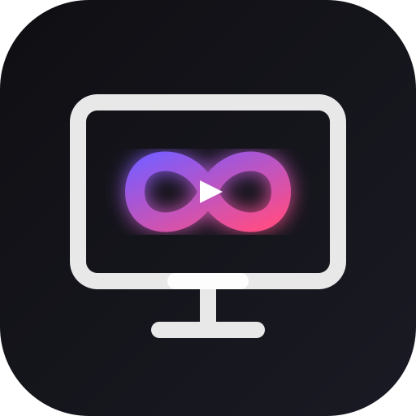

<div align="center">

  <br />
  
  <br />

  # ScreenLoop

  **Zero-friction, peer-to-peer watch party & screen sharing platform with end-to-end encrypted chat.**

  <p align="center">
    <a href="https://vercel.com/new/clone?repository-url=https%3A%2F%2Fgithub.com%2FHimanshusingh204%2FScreenLoop"></a>
  </p>

  <p align="center">
    <a href="https://github.com/Himanshusingh204/ScreenLoop/actions/workflows/ci.yml"></a>
    <a href="https://github.com/Himanshusingh204/ScreenLoop/actions/workflows/codeql.yml"></a>
    <a href="https://opensource.org/licenses/MIT"></a>
    <a href="https://react.dev/"></a>
    <a href="https://vitejs.dev/"></a>
    <a href="https://webrtc.org/"></a>
    <a href="https://socket.io/"></a>
  </p>

</div>

---

## Table of Contents

- [Overview](#overview)
- [Why ScreenLoop?](#why-screenloop)
- [Key Features](#key-features)
- [Architecture & Data Flow](#architecture--data-flow)
- [Getting Started](#getting-started)
  - [Prerequisites](#prerequisites)
  - [Local Development](#local-development)
- [Deployment](#deployment)
  - [Frontend Deployment (Vercel)](#frontend-deployment-vercel)
  - [Backend Signaling Deployment (Render / Railway)](#backend-signaling-deployment-render--railway)
  - [Environment Variables](#environment-variables)
- [Keyboard Shortcuts](#keyboard-shortcuts)
- [Testing & Quality Assurance](#testing--quality-assurance)
- [Repository Structure](#repository-structure)
- [Security & Privacy](#security--privacy)
- [Contributing & Community](#contributing--community)
- [License](#license)

---

## Overview

**ScreenLoop** is a modern, privacy-focused watch party and screen sharing platform designed for seamless group watching, remote collaboration, and live presentations.

Unlike conventional video conferencing tools that route video through heavy media servers or aggressively compress stereo sound with vocal noise filters, ScreenLoop connects viewers directly over a **WebRTC peer-to-peer mesh**. Audio is streamed cleanly with high fidelity, while chat messages are encrypted client-side using **AES-256-GCM** via the Web Crypto API.

- **No accounts or signups required**
- **No software or extension downloads**
- **Zero video/audio data touches the server**
- **Decryption keys never leave the browser URL fragment**

---

## Why ScreenLoop?

| Feature | Standard Meeting Tools (Zoom, Meet, Discord) | ScreenLoop |
| :--- | :--- | :--- |
| **Media Routing** | Centralized media servers (SFU/MCU) | **100% Peer-to-Peer (WebRTC Mesh)** |
| **Movie Audio Quality** | Aggressive noise suppression downsamples stereo audio | **Lossless, uncompressed stereo pass-through** |
| **Chat Encryption** | Server-side or readable by service host | **End-to-End Encrypted (AES-256-GCM in browser)** |
| **Account Required** | Yes (email, OAuth, or phone verification) | **None (Zero registration, instant ephemeral rooms)** |
| **Decryption Key Storage** | Server databases / Key management services | **URL Hash Fragment (Never transmitted over network)** |
| **Installation** | Client downloads or browser extensions | **Pure Web Standards (Works out-of-the-box)** |

---

## Key Features

### 🎬 High-Fidelity Streaming & Audio
- **Direct WebRTC P2P Mesh**: Stream up to 1080p60 directly between peers without server bottlenecks.
- **Cinema-Grade Audio**: Echo cancellation and speech filters disabled so music, cinematic soundtracks, and movie audio play exactly as mastered.
- **Web Audio Volume Booster**: Built-in gain node amplification for movies with quiet dialogue.
- **Dynamic Resolution Controls**: Adaptive quality presets (1080p, 720p, 480p) with connection fallback.

### 🔒 Privacy & Cryptographic Security
- **In-Browser AES-256-GCM**: Every message is encrypted and decrypted on the client using `window.crypto.subtle`.
- **RFC 3986 URL Hash Isolation**: The cryptographic room key resides in the URL `#hash` fragment and is never sent to the signaling server in HTTP requests.
- **Optional Room PIN Protection**: Salted/hashed PIN protection prevents unauthorized room entry.
- **Strict Content-Security-Policy**: Hardened headers prevent XSS, clickjacking, and unauthorized origin framing.

### 🤝 Real-Time Collaboration & Room Control
- **Live Canvas Annotations**: Freehand drawing tools and synchronized laser pointer overlay directly on the stream.
- **Interactive Reactions**: Animated emoji reactions and confetti bursts powered by Canvas Confetti.
- **Live Diagnostics Dashboard**: Real-time telemetry monitoring FPS, bitrate (kbps), packet loss, and round-trip time (RTT).
- **Host Privileges**: Manage participant access, kick unauthorized users, or transfer room ownership.
- **Picture-in-Picture (PiP)**: Keep watch parties playing in a floating desktop overlay while multitasking.
- **Screen Wake Lock**: Prevents screens from sleeping or dimming during long movie sessions.

---

## Architecture & Data Flow

ScreenLoop separates the **signaling plane** from the **media plane** to guarantee maximum performance and absolute privacy:

```
                          ┌─────────────────────────────────────────┐
                          │         Signaling Coordinator           │
                          │          Node.js + Socket.IO            │
                          │   - Ephemeral room session state        │
                          │   - SDP Offer/Answer negotiation        │
                          │   - ICE candidate exchange              │
                          │   - Rate limiting & room protection     │
                          └────────────────────┬────────────────────┘
                                               │
                                 WebSocket     │     WebSocket
                                 Signaling     │     Signaling
                                               │
               ┌───────────────────────────────┴───────────────────────────────┐
               │                                                               │
               ▼                                                               ▼
  ┌─────────────────────────┐         Encrypted WebRTC P2P Mesh      ┌─────────────────────────┐
  │       Host Client       │═══════════════════════════════════════>│      Viewer Client      │
  │    (React 18 + Vite)    │        Direct Video & Audio Tracks     │    (React 18 + Vite)    │
  │                         │                                        │                         │
  │ • getDisplayMedia()     │< - - - - - - - - - - - - - - - - - - - │ • MediaStream rendering │
  │ • Web Audio Gain Boost  │     End-to-End Encrypted Chat Data     │ • Web Audio Gain Boost  │
  │ • AES-256-GCM Encrypt   │ - - - - - - - - - - - - - - - - - - - >│ • AES-256-GCM Decrypt   │
  │ • Laser & Draw Canvas   │       Real-Time Sync Annotations       │ • Canvas Sync Render    │
  └─────────────────────────┘                                        └─────────────────────────┘
```

### Encryption Protocol Lifecycle

1. **Key Generation**: When a room is created, the host browser generates a cryptographically secure 256-bit AES-GCM key via `crypto.subtle.generateKey`.
2. **Zero-Knowledge URL Sharing**: The key is serialized and appended to the URL fragment (`/room/ROOM_ID#ROOM_KEY`). Per RFC 3986, browser user agents **never** transmit the hash fragment across the network to HTTP or WebSocket servers.
3. **Payload Encryption**: Chat messages and sensitive annotations are encrypted with AES-256-GCM and a unique 12-byte initialization vector (IV) before transmission.
4. **Decryption**: Connected peers extract the key from their local URL hash to decrypt payloads in memory.

---

## Getting Started

### Prerequisites

- **Node.js**: `v18.0.0` or higher (`v20.x` LTS recommended)
- **npm**: `v9.0.0` or higher
- Modern Chromium, Gecko, or WebKit browser with WebRTC support (Chrome, Edge, Firefox, Brave, Safari 15+)

### Local Development

1. **Clone the repository:**
   ```bash
   git clone https://github.com/Himanshusingh204/ScreenLoop.git
   cd ScreenLoop
   ```

2. **Install root, client, and server dependencies:**
   ```bash
   # Install root dependencies
   npm install

   # Install client and server dependencies
   cd client && npm install
   cd ../server && npm install
   cd ..
   ```

3. **Start the backend signaling server (port 4000):**
   ```bash
   cd server
   npm run dev
   ```

4. **In a separate terminal, start the frontend Vite client (port 5173):**
   ```bash
   cd client
   npm run dev
   ```

5. Visit `http://localhost:5173` in your browser. Open a secondary browser or incognito window to simulate multiple participants.

---

## Deployment

ScreenLoop is engineered for zero-config production deployment.

### Frontend Deployment (Vercel)

[](https://vercel.com/new/clone?repository-url=https%3A%2F%2Fgithub.com%2FHimanshusingh204%2FScreenLoop)

The repository includes a production-ready [vercel.json](vercel.json) at the root level and in the [client/](client/vercel.json) directory:

1. Click the **Deploy with Vercel** button above, or import your GitHub repository on [vercel.com](https://vercel.com).
2. Configure the following Environment Variable in your Vercel Project Settings:
   - `VITE_SERVER_URL`: URL of your deployed signaling server (e.g. `https://screenloop-server.onrender.com`).
3. Deploy! Single-page app routing, WebRTC media policies, and immutable asset caching are handled automatically.

### Backend Signaling Deployment (Render / Railway)

Because ScreenLoop only requires signaling (lightweight WebSocket messages), the server can run on free or low-cost cloud tiers.

#### Deploy to Render:
1. Create a new **Web Service** on [render.com](https://render.com).
2. Connect your repository.
3. Configure the service settings:
   - **Root Directory**: `server`
   - **Build Command**: `npm install`
   - **Start Command**: `node src/index.js`
4. Set Environment Variables:
   - `PORT`: `4000`
   - `ALLOWED_ORIGIN`: Your deployed Vercel frontend URL (e.g., `https://screenloop.vercel.app`).

### Environment Variables

#### Client (`client/.env`)
| Variable | Description | Default (Dev) |
| :--- | :--- | :--- |
| `VITE_SERVER_URL` | Base URL of the Socket.IO signaling server | `http://localhost:4000` |

#### Server (`server/.env`)
| Variable | Description | Default (Dev) |
| :--- | :--- | :--- |
| `PORT` | Listening port for the Express/Socket.IO server | `4000` |
| `ALLOWED_ORIGIN` | CORS allowed origin for HTTP and WebSocket connections | `http://localhost:5173` |

---

## Keyboard Shortcuts

| Shortcut | Action | Scope |
| :---: | :--- | :--- |
| <kbd>F</kbd> | Toggle Fullscreen mode | Active Room |
| <kbd>M</kbd> | Mute / Unmute stream audio | Active Room |
| <kbd>Esc</kbd> | Close overlays, sidebars, or exit fullscreen | Global |
| <kbd>Enter</kbd> | Send chat message | Chat Panel |
| <kbd>Shift</kbd> + <kbd>Enter</kbd> | Insert new line in chat | Chat Panel |

---

## Testing & Quality Assurance

Comprehensive unit and integration test suites cover signaling logic, room state, crypto sanitization, and UI utilities.

```bash
# Run server test suite (Vitest)
cd server
npm test

# Run client test suite (Vitest)
cd client
npm test

# Run client production build verification
cd client
npm run build
```

---

## Repository Structure

```
ScreenLoop/
├── .github/
│   ├── ISSUE_TEMPLATE/        # Structured Bug Report & Feature Request templates
│   ├── workflows/             # CI Build matrix & CodeQL security scans
│   ├── PULL_REQUEST_TEMPLATE  # Standardized PR checklist
│   └── dependabot.yml         # Automated dependency updates
├── client/                    # React 18 frontend application (Vite)
│   ├── public/                # Static assets, SVG icons, manifest
│   ├── src/
│   │   ├── components/        # Reusable UI components & dialogs
│   │   ├── hooks/             # WebRTC, WebSocket, wake lock, & screen recording hooks
│   │   ├── pages/             # Route pages (Home, Room, Security, Roadmap, etc.)
│   │   ├── styles/            # Vanilla CSS design tokens & component styles
│   │   └── utils/             # AES crypto, audio booster, linkifier, sanitizers
│   └── vercel.json            # Client-specific Vercel routing & headers
├── server/                    # Node.js Socket.IO signaling service
│   ├── src/
│   │   ├── index.js           # Server bootstrap & health check endpoints
│   │   ├── roomManager.js     # Ephemeral in-memory room state
│   │   ├── socketHandlers.js  # WebRTC signaling event router
│   │   └── rateLimiter.js     # IP & socket connection rate limiting
│   └── __tests__/             # Server vitest test suites
├── vercel.json                # Root zero-config Vercel deployment configuration
├── CONTRIBUTING.md            # Contributor setup & branching guides
├── CODE_OF_CONDUCT.md         # Contributor Covenant Code of Conduct
├── SECURITY.md                # Security policy & private vulnerability reporting
└── LICENSE                    # MIT License
```

---

## Security & Privacy

- **Zero Data Collection**: ScreenLoop maintains no persistent databases, logs no user accounts, and stores no analytical tracking scripts.
- **Ephemeral State**: Rooms and connection metadata exist only in memory on the signaling server and are immediately garbage-collected when the host disconnects.
- **DTLS-SRTP Encryption**: Direct audio/video tracks are encrypted under mandatory WebRTC DTLS-SRTP specifications.
- **Vulnerability Disclosures**: If you discover a security vulnerability, please report it via [GitHub Security Advisories](https://github.com/Himanshusingh204/ScreenLoop/security/advisories/new) as detailed in our [Security Policy](SECURITY.md).

---

## Contributing & Community

Contributions make open-source software incredible. We welcome bug fixes, documentation improvements, and feature contributions!

- Review our [Contributing Guide](CONTRIBUTING.md) to get started with branching and testing.
- Please review and adhere to our [Code of Conduct](CODE_OF_CONDUCT.md).
- Open discussions and feature suggestions in our [GitHub Issues](https://github.com/Himanshusingh204/ScreenLoop/issues).

---

## License

Distributed under the **MIT License**. See [LICENSE](LICENSE) for details.

<div align="center">
  <sub>Built with ❤️ for watch parties, privacy, and seamless peer-to-peer collaboration.</sub>
</div>
