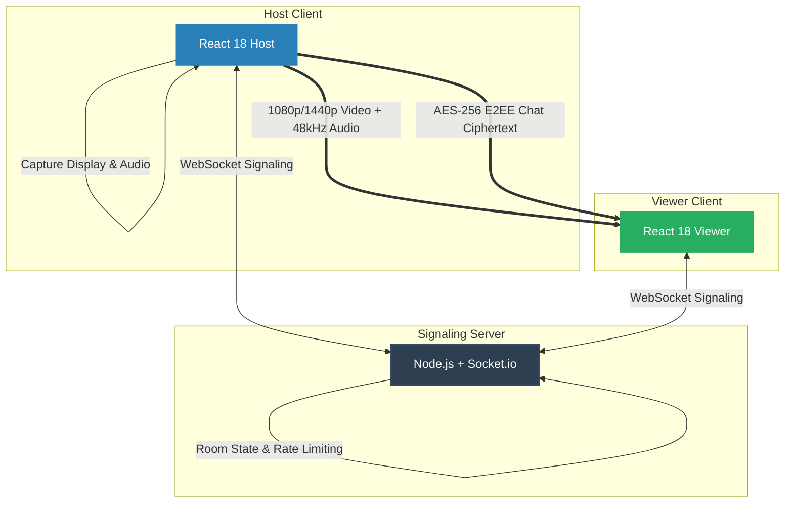

<div align="center">
  
  # 🎬 Screenloop Pro
  
  **Ultra-HD Peer-to-Peer Screen Sharing & Synchronized Watch Party Web Platform**

  [](https://opensource.org/licenses/MIT)
  [](https://reactjs.org/)
  [](https://nodejs.org/)
  [](https://socket.io/)
  [](https://webrtc.org/)

  *Zero signups. Zero media storage. 48kHz uncompressed cinema audio. AES-GCM 256-bit End-to-End Encryption.*

</div>

---

## 🌟 Key Features

- 🖥 **Peer-to-Peer Screen Sharing**: WebRTC direct mesh stream up to 1440p 2K resolution at 30/60 fps.
- 🔊 **48 kHz Uncompressed Cinema Audio**: Dynamic range preserving stereo sound tuned specifically for movies (echo cancellation & noise suppression turned OFF).
- 🔒 **AES-GCM 256-bit End-to-End Encryption**: Chat is encrypted client-side using a key stored in the URL hash fragment (`#key`). The server acts purely as a blind relay.
- ✏️ **Live Screen Drawing & Annotations**: Host can draw over the live stream with Pen, Highlighter, and Eraser tools synchronized in real-time.
- ⚡ **Web Audio Dialogue & Volume Booster**: Built-in dynamic range compressor and gain booster (up to 200%) for quiet movie dialogue.
- 📊 **Real-Time Telemetry HUD**: Monitor live stream FPS, bitrate (kbps), round-trip latency (ms), and packet loss diagnostics.
- 📱 **1-Tap QR Code Mobile Join**: Scan with any smartphone camera to immediately enter the watch room with encryption keys intact.
- 📲 **Native Web Share API**: 1-tap sharing via native AirDrop, WhatsApp, Messages, or Email on iOS, Android, and macOS.
- 👁️ **Screen Wake Lock API**: Automatically prevents user displays from sleeping or dimming during movie playback.
- 🎨 **Obsidian Glassmorphic Design**: Curated premium themes including Midnight Obsidian, OLED Black, Cyber Ocean, and Crimson Noir.

---

## 📐 Architecture & Data Flow

Our system employs a hybrid architecture, combining a lightweight signaling server for connection orchestration and WebRTC for direct peer-to-peer heavy media transmission.



### System Components:
1. **Signaling Server**: Handles the initial WebRTC SDP Handshake & ICE Relay. It tracks room state but **never** processes or stores the media stream.
2. **Host Client**: Captures the screen via `getDisplayMedia()`, processes audio, and establishes the mesh network.
3. **Viewer Client**: Receives the decrypted media stream directly from the Host, decrypts text chat locally using the shared URL hash key.

---

## 🛠️ Environments Setup

The project enforces a strict separation between **Development** and **Production** environments to ensure security, performance, and clear debugging processes.

### 💻 Local Development

Ideal for testing features, debugging, and contributing.

**Prerequisites**: **Node.js 18+** and **npm**

1. **Start the Signaling Server**:
   ```bash
   cd server
   npm install
   # Uses .env.development (or default fallback)
   npm run dev
   ```
   *Runs at `http://localhost:4000` (listening on all interfaces `0.0.0.0:4000` for LAN access).*

2. **Start the Frontend Client**:
   Open a new terminal window:
   ```bash
   cd client
   npm install
   # Connects to localhost:4000
   npm run dev
   ```
   *Runs at `http://localhost:5173`.*

### 🚀 Production Deployment

Optimized builds with minification, tree-shaking, and secure HTTPS enforced communication.

**Backend (Signaling Server):**
- **Hosting**: Render, Railway, or VPS.
- **Environment Variables**:
  - `PORT=4000`
  - `ALLOWED_ORIGIN=https://your-frontend-domain.com` (Strict CORS policy)
- **Command**: `npm install && node src/index.js`

**Frontend (Client):**
- **Hosting**: Vercel, Netlify, or Cloudflare Pages.
- **Environment Variables**:
  - `VITE_SERVER_URL=https://your-backend-domain.com`
- **Command**: `npm run build`
- **Output Directory**: `dist`

---

## 🔒 Security & Privacy

Privacy is the core pillar of Screenloop Pro:

- **Zero Media Storage**: Streams are peer-to-peer over WebRTC. Media never touches any database or server.
- **Client-Side Key Derivation**: Room keys reside exclusively in the `#key` URL hash fragment, which is never sent in HTTP request headers.
- **XSS Sanitization**: User inputs and chat payloads are scrubbed before DOM presentation.
- **Anti-Spam**: Socket handlers implement sliding-window rate limits and PIN brute-force lockouts.
- **Data Anonymity**: No personal data, email addresses, or user profiles are required or collected.

---

## 📂 Repository Structure

```text
Screenshare/
├── .github/workflows/   # CI/CD pipelines
├── client/              # React 18 SPA Frontend
│   ├── src/
│   │   ├── components/  # Reusable UI components
│   │   ├── hooks/       # Custom React hooks (WebRTC, Audio, etc.)
│   │   ├── pages/       # Route level components
│   │   └── utils/       # Helpers (Crypto, formatters, etc.)
│   ├── .env.example     # Client env template
│   └── package.json     
└── server/              # Node.js Signaling Backend
    ├── src/             # Socket.io handlers, Room logic, Rate Limiting
    ├── .env.example     # Server env template
    └── package.json
```

---

## ⌨️ Keyboard Shortcuts

| Shortcut | Action |
|:---:|:---|
| <kbd>M</kbd> | Toggle Audio Mute / Unmute |
| <kbd>F</kbd> | Toggle Fullscreen Cinema Mode |
| <kbd>Esc</kbd> | Exit Fullscreen / Close Overlays |

---

## 📄 License & Author

Distributed under the MIT License. See `LICENSE` for more information.

<div align="center">
  <p>Engineered and developed by <strong>Himanshu</strong>.</p>
  <p>Built with ❤️ for seamless sharing and immersive experiences.</p>
</div>
